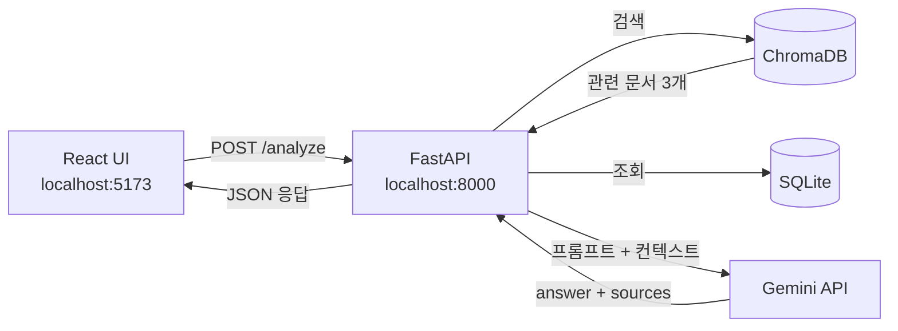

# CareerFit AI

> 취업·공모전 데이터 기반 맞춤형 AI 포트폴리오 코치

## 프로젝트 개요

취업·공모전 정보는 여러 사이트와 파일에 흩어져 있고, 사용자는 자신의 전공·스킬·관심 직무에 맞는 기회를 빠르게 판단하기 어렵다. CareerFit AI는 채용공고와 공모전 데이터를 바탕으로 사용자의 역량을 분석하고, 어떤 공고를 근거로 답변했는지 함께 보여주는 맞춤형 커리어 코치다.

이 프로젝트는 RAG 구조를 사용한다. 사용자의 입력을 FastAPI가 받아 ChromaDB에서 관련 문서를 검색하고, 검색된 컨텍스트를 Gemini API에 전달해 `answer`와 `sources`를 포함한 응답을 만든다.

## 기술 스택

| 영역 | 기술 |
|---|---|
| 백엔드 | Python 3.12, FastAPI |
| AI API | Gemini 2.5 Flash-Lite |
| 데이터 | Pandas, SQLite, ChromaDB |
| 프론트엔드 | React, Vite, Tailwind CSS |
| 실행 환경 | Docker, Render |

## 아키텍처



## 실행 방법

### Docker로 실행

```bash
# 1. 이미지 빌드
docker build -t careerfit-ai ./backend

# 2. 컨테이너 실행
docker run -p 8000:8000 --env-file backend/.env careerfit-ai
```

API 문서:

```text
http://localhost:8000/docs
```

상태 확인:

```text
http://localhost:8000/health
```

### 로컬 백엔드 실행

Windows PowerShell 기준:

```powershell
cd backend
py -3.12 -m venv venv
.\venv\Scripts\activate
pip install -r requirements.txt
uvicorn main:app --reload --port 8000
```

macOS/Linux 기준:

```bash
cd backend
python -m venv venv
source venv/bin/activate
pip install -r requirements.txt
uvicorn main:app --reload --port 8000
```

### 로컬 프론트엔드 실행

```bash
cd frontend
npm install
npm run dev
```

프론트엔드 개발 서버:

```text
http://localhost:5173
```

프론트엔드는 기본적으로 `http://localhost:8000` 백엔드를 호출한다. 배포 환경에서는 `VITE_API_BASE_URL`로 백엔드 주소를 지정한다.

## 환경변수

실제 `.env` 파일은 GitHub에 올리지 않는다. 필요한 값은 `.env.example`, `backend/.env.example`, `frontend/.env.example`을 참고해 로컬이나 Render 환경변수에 직접 입력한다.

백엔드 예시:

```env
GEMINI_API_KEY=your_gemini_api_key_here
LLM_MODEL=gemini-2.5-flash-lite
MOCK_MODE=false
FRONTEND_ORIGINS=http://localhost:5173,http://127.0.0.1:5173,https://your-frontend-service.onrender.com
```

프론트엔드 예시:

```env
VITE_API_BASE_URL=http://localhost:8000
```

Render 프론트엔드 배포 시:

```env
VITE_API_BASE_URL=https://careerfit-ai-cji.onrender.com
```

## API

| Method | Endpoint | 설명 |
|---|---|---|
| GET | `/` | 서버 루트 응답 |
| GET | `/health` | 서버 상태 확인 |
| GET | `/jobs` | 채용공고 목록 조회 |
| GET | `/jobs/{job_id}` | 특정 채용공고 조회 |
| POST | `/analyze` | 사용자 역량 분석 및 RAG 기반 답변 생성 |

`POST /analyze` 요청 예시:

```json
{
  "major": "세무학과",
  "skills": ["KICPA", "Excel", "재무회계"],
  "job_type": "공인회계사"
}
```

응답 예시:

```json
{
  "answer": "사용자 역량 분석 결과와 추천 방향",
  "sources": [
    {
      "company": "회사명",
      "title": "공고명",
      "required_skills": "필요 역량",
      "job_type": "직무 유형",
      "distance": 1.23
    }
  ]
}
```

## 데이터 파이프라인

```text
CSV → Pandas 전처리 → SQLite 구조화 저장 → ChromaDB 벡터 검색 → FastAPI /analyze 연결
```

전처리 실행:

```bash
cd backend
python data/preprocess.py
```

데이터 처리 흐름:

- `jobs.csv`, `competitions.csv`를 Pandas로 로드
- 결측치와 중복 데이터 정리
- 스킬 키워드 표준화
- SQLite 저장
- RAG 문서 구조로 변환
- ChromaDB에서 의미 기반 검색

## 주요 기능

- RAG 기반 역량 분석: 사용자 전공, 스킬, 관심 직무를 바탕으로 관련 공고를 검색하고 맞춤형 조언을 생성한다.
- 출처 표시: AI 답변에 사용된 공고 데이터를 `sources`로 반환하고 React UI에서 출처 카드로 보여준다.
- Mock Mode: API 한도 초과나 비용 절약이 필요할 때 `MOCK_MODE=true`로 실제 LLM 호출 없이 테스트할 수 있다.
- 환경변수 기반 배포: 프론트엔드는 `VITE_API_BASE_URL`, 백엔드는 `FRONTEND_ORIGINS`로 로컬과 Render 환경을 분리한다.

## 프로젝트 구조

```text
careerfit_ai_CJI/
├── backend/                  # FastAPI 서버
│   ├── main.py
│   ├── routers/
│   ├── services/
│   ├── data/
│   ├── Dockerfile
│   └── requirements.txt
├── frontend/                 # React/Vite UI
│   ├── src/
│   ├── Dockerfile
│   └── package.json
├── docs/                     # 프로젝트 문서
│   ├── CHECKLIST.md
│   ├── EVAL_QUESTIONS.md
│   └── render-frontend-deploy.md
├── harness/                  # AI-assisted development harness
│   ├── MAIN_HARNESS.md
│   ├── ROUTING.md
│   ├── agents/
│   ├── checks/
│   └── skills/
└── README.md
```

## 배포

백엔드는 Docker 기반 Render Web Service로 배포한다.

```text
Backend URL: https://careerfit-ai-cji.onrender.com
Health Check: https://careerfit-ai-cji.onrender.com/health
```

프론트엔드는 Render Static Site 또는 Docker Web Service로 배포할 수 있다. 자세한 과정은 [docs/render-frontend-deploy.md](docs/render-frontend-deploy.md)를 참고한다.

프론트엔드 Render 환경변수:

```env
VITE_API_BASE_URL=https://careerfit-ai-cji.onrender.com
```

백엔드 Render 환경변수:

```env
FRONTEND_ORIGINS=https://your-frontend-service.onrender.com
GEMINI_API_KEY=your_gemini_api_key_here
```

## 보안

- `.env`와 `.env.*`는 GitHub에 올리지 않는다.
- 실제 API Key는 Render 환경변수 또는 로컬 `.env`에만 둔다.
- React 코드에는 API Key를 넣지 않는다.
- `backend/chroma_db/`, `frontend/dist/`, `node_modules/`, `venv/`는 재생성 가능하므로 Git에서 제외한다.

## 향후 개선

- [ ] 이력서 PDF 업로드 후 자동 역량 추출
- [ ] 공모전 마감일 알림 기능
- [ ] RAG 검색 품질 평가 지표 추가
- [ ] 사용자별 저장 이력과 추천 결과 비교 기능
- [ ] 한국어 검색 품질 개선을 위한 임베딩 모델 교체 또는 외부 임베딩 API 적용

## 개발 과정

가장 어려웠던 부분은 ChromaDB 검색 결과와 LLM 답변을 자연스럽게 연결하면서도, 프론트엔드가 사용할 수 있는 단순한 JSON 응답 구조를 유지하는 것이었다. 이를 해결하기 위해 검색 로직(`rag_service.py`)과 답변 생성 로직(`llm_service.py`)을 분리하고, `/analyze`는 `answer`와 `sources`만 안정적으로 반환하도록 정리했다.

## Demo

- Backend API: https://careerfit-ai-cji.onrender.com
- API Docs: https://careerfit-ai-cji.onrender.com/docs
- Frontend Demo: 배포 후 프론트엔드 URL 추가 예정

## Developer

- Name: CJI
- Role: Backend / AI Service Development
- GitHub: [@CJI0718](https://github.com/CJI0718)
